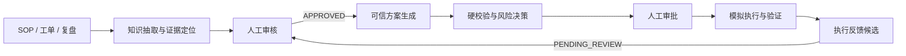
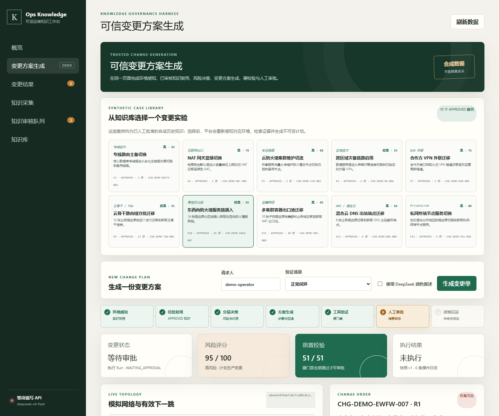
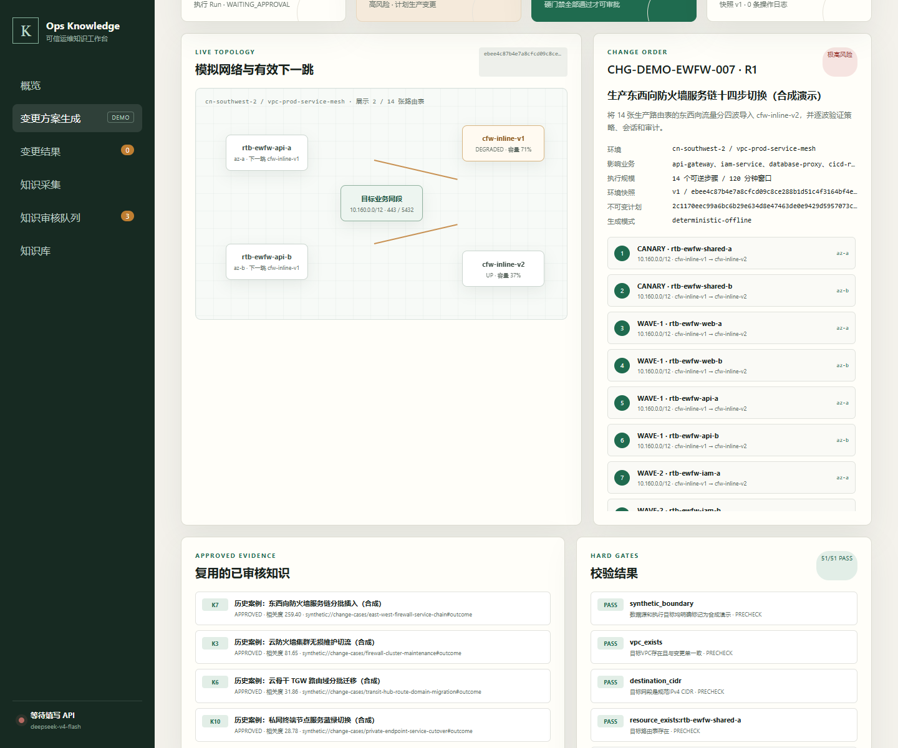
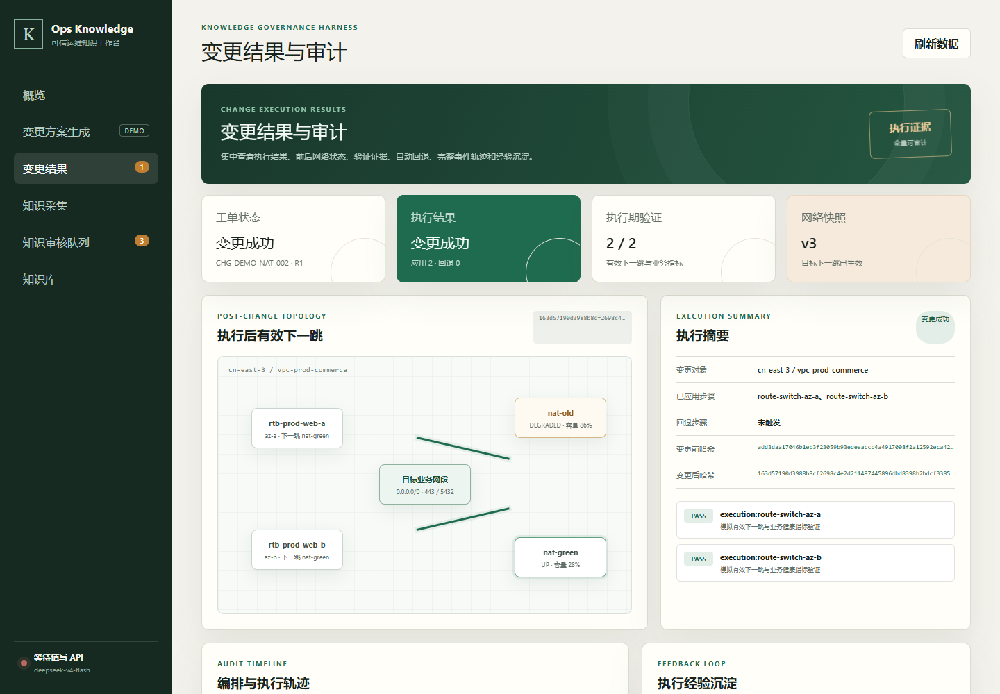
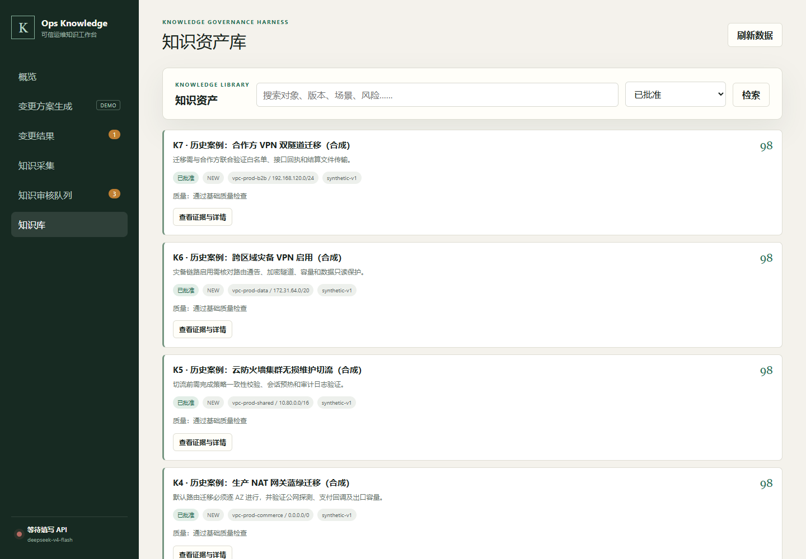

# Ops Knowledge Studio

[](https://github.com/Ptttt1t/ops-knowledge-studio-public/actions/workflows/ci.yml)

一个面向运维场景的本地知识治理与可信变更工作台。它把 SOP、工单、复盘和历史方案转化为可审核的知识资产，再用这些已批准知识生成变更方案，经硬校验、人工审批、模拟执行和结果回流形成完整闭环。

> [!IMPORTANT]
> 仓库内置的云网络案例、资源标识、指标和执行结果全部是合成演示数据。当前版本不会连接真实华为云、AWS、Azure、CMDB、监控或工单系统，也不接受真实云凭据。

## 这个项目解决什么问题

普通 RAG 可以“找到资料并回答”，但生产运维还需要回答另外几个问题：引用的知识是否经过审核、执行动作是否与当前环境一致、谁批准了什么参数、失败后能否安全回退，以及这次执行经验如何进入下一轮知识治理。

Ops Knowledge Studio 将这些环节放进同一个可审计流程：



核心原则：

- **上下文可信**：只有 `APPROVED` 知识可以进入可信方案；回答保留 `[K编号]` 证据引用。
- **决策分层**：模型负责语言理解与叙述，资源、动作、阈值、审批和回退由确定性规则控制。
- **工具受控**：非只读工具必须经过持久化审批，审批与具体参数摘要绑定。
- **全程可追溯**：运行状态、检查点、工具调用、前后快照、验证结果和操作者均写入审计记录。
- **反馈不直发**：新执行经验只生成 `PENDING_REVIEW` 候选，不会自动升级为可信知识。

## 功能总览

| 模块 | 能力 | 关键约束 |
| --- | --- | --- |
| 知识采集 | 上传文档或粘贴文本，分片、抽取知识卡片并精确定位来源 | 抽取结果默认进入待审核状态 |
| 知识治理 | 质量评分、重复/冲突/新版本比较、批准、驳回与替代 | 只有 `APPROVED` 可被可信检索 |
| 可信方案 | 本地混合检索 + DeepSeek 生成带证据的运维建议 | 无强相关证据时拒绝给出可信方案 |
| 变更生成 | 环境感知、知识复用、风险评分、分步计划、验证与回退生成 | 所有云资源与网络均为隔离模拟 |
| 审批执行 | 精确确认串、参数摘要、灰度执行、故障注入与自动回退 | 审批前不修改模拟网络 |
| 运行时 | SQLite Run、事件、步骤、检查点、取消、恢复和幂等执行 | 参数漂移或快照漂移会使旧审批失效 |
| 反馈闭环 | 将执行日志和结果整理为知识候选 | 必须再次人工审核 |

## 界面预览

### 1. 从已批准案例生成变更方案

页面统一展示案例选择、风险、前置校验、模拟拓扑、知识证据、分步操作、验证项和人工审批入口。



### 2. 展开十几步复杂变更计划

复杂案例会按 `CANARY / WAVE-1 / WAVE-2 / FINAL` 等波次生成长计划。下图为 14 步东西向防火墙服务链变更，包含 120 分钟窗口、51 项硬校验和逐路由表回退日志。



### 3. 查看执行结果与完整审计

结果页集中展示工单终态、执行后有效下一跳、步骤验证、前后状态哈希、自动回退信息和审计时间线。



### 4. 回到统一知识资产库

历史案例以 `APPROVED` 知识参与下一次方案生成；新执行反馈仍停留在审核队列。



## 快速开始

### 环境要求

- Python 3.10 或更高版本；
- Git；
- Windows、Linux 或 macOS；
- DeepSeek API Key 为可选项：离线变更演示、知识浏览和本地治理不需要 Key。

### Windows + Conda

```bat
conda create -n ops-knowledge-studio python=3.10 -y
conda activate ops-knowledge-studio
git clone https://github.com/Ptttt1t/ops-knowledge-studio-public.git
cd ops-knowledge-studio-public
python -m pip install --upgrade pip
python -m pip install -c constraints/base.txt -e .
copy .env.example .env
python run.py generate-access-token
python run.py init
python run.py serve
```

### Linux / macOS

```bash
conda create -n ops-knowledge-studio python=3.10 -y
conda activate ops-knowledge-studio
git clone https://github.com/Ptttt1t/ops-knowledge-studio-public.git
cd ops-knowledge-studio-public
python -m pip install --upgrade pip
python -m pip install -c constraints/base.txt -e .
cp .env.example .env
python run.py generate-access-token
python run.py init
python run.py serve
```

启动后访问：

- Web 工作台：<http://127.0.0.1:8765>
- 无鉴权存活检查：<http://127.0.0.1:8765/api/health/live>

将令牌命令输出的 `PLATFORM_ACCESS_TOKEN_HASH=...` 写入 `.env`，浏览器首次打开时输入对应明文令牌。日常启动只需要激活环境并执行 `python run.py serve`。

## 三分钟体验变更闭环

推荐从 Web 界面体验：

1. 启动服务，打开左侧 **变更方案生成**。
2. 从案例库选择一个场景，例如 **NAT 网关蓝绿切换**。
3. 选择 **正常闭环**，点击 **生成变更单**。
4. 核对环境快照、知识证据、风险、硬校验、计划哈希和回退方案。
5. 输入页面提示的精确确认串，例如 `APPROVE CHG-DEMO-NAT-002`。
6. 批准后观察双 AZ 灰度执行；完成后进入 **变更结果** 查看证据和审计。
7. 可选择将执行经验送入知识审核队列，再由人工决定是否批准。

直接拒绝、关闭标准输入或输入错误确认串都不会修改模拟网络。

## 内置云网络案例

平台预置 10 个 `APPROVED` 合成历史案例。案例定义同时驱动环境模拟、知识检索、变更单生成和前端拓扑，避免界面与实际执行逻辑脱节。其中 3 个复杂案例分别包含 10、12、14 个可执行、可验证、可逆序回退的路由步骤。

| 案例 ID | 变更单 | 场景 | 执行步骤 | 核心动作 |
| --- | --- | --- | ---: | --- |
| `dc-route-failover` | `CHG-DEMO-ROUTE-001` | 专线路由主备切换 | 2 | 双 AZ 路由从劣化主专线切至健康备用专线 |
| `nat-egress-bluegreen` | `CHG-DEMO-NAT-002` | NAT 网关蓝绿切换 | 2 | 生产出口按 AZ 从旧 NAT 切至绿色 NAT |
| `firewall-cluster-maintenance` | `CHG-DEMO-CFW-003` | 云防火墙集群维护切流 | 2 | 将流量切至备用防火墙节点完成维护 |
| `cross-region-dr-activation` | `CHG-DEMO-DR-004` | 跨区域灾备链路启用 | 2 | 启用受控灾备路径并验证有效路由 |
| `partner-extranet-migration` | `CHG-DEMO-B2B-005` | 合作方 VPN 外联迁移 | 2 | 将合作方访问迁移至新的双隧道链路 |
| `transit-hub-route-domain-migration` | `CHG-DEMO-TGW-006` | 云骨干路由域分批迁移 | 12 | 按运维、应用、数据、共享服务四波迁移 TGW 路由域 |
| `east-west-firewall-service-chain` | `CHG-DEMO-EWFW-007` | 东西向防火墙服务链插入 | 14 | 分四波将七个业务域导入新版有状态防火墙 |
| `kubernetes-egress-pool-migration` | `CHG-DEMO-K8S-008` | 多集群容器出口池迁移 | 10 | 按业务等级迁移五组双 AZ Kubernetes 出口路由 |
| `dns-resolver-endpoint-migration` | `CHG-DEMO-DNS-009` | 混合云 DNS 出站端点迁移 | 6 | 逐域迁移共享、应用、数据 DNS 出站路径 |
| `private-endpoint-service-cutover` | `CHG-DEMO-PES-010` | 私网终端节点服务切换 | 4 | 切换批处理与分析域 PrivateLink 路由 |

所有案例都会检查资源存在性、CIDR、冲突路由、当前下一跳、备用链路健康度、容量、变更窗口和知识审批状态。执行阶段按案例阈值验证有效下一跳、连通率、丢包和时延；硬校验失败时阻断或按计划逆序回退。

## 命令行演示

### 正常闭环

```powershell
python run.py demo-change
```

指定案例：

```powershell
python run.py demo-change --case-id nat-egress-bluegreen
```

体验 14 步复杂计划：

```powershell
python run.py demo-change --case-id east-west-firewall-service-chain
```

程序会打印变更摘要、知识引用、风险、计划哈希、环境快照和校验结果，然后等待精确确认串。

### 故障注入与自动回退

```powershell
python run.py demo-change --inject-failure route-switch-az-b
```

也可以在指定案例中注入故障：

```powershell
python run.py demo-change --case-id east-west-firewall-service-chain --inject-failure route-switch-ewfw-data-b
```

### 可选模型润色

```powershell
python run.py demo-change --use-model
```

模型只允许润色标题和摘要，不能修改资源标识、CIDR、下一跳、阈值、执行步骤或回退逻辑。模型不可用或输出不合格时会明确记录降级，并回到确定性模板。

## 配置 DeepSeek

复制 `.env.example` 为 `.env`，填写：

```dotenv
DEEPSEEK_API_KEY=你的API密钥
DEEPSEEK_BASE_URL=https://api.deepseek.com
DEEPSEEK_MODEL=deepseek-v4-flash
```

项目使用 OpenAI 兼容的 `POST /chat/completions`。若使用兼容代理服务，只替换 Key、Base URL 和模型名，不要把 `/chat/completions` 写进 Base URL。

DeepSeek 用于：

- 将原始文档抽取为固定 Schema 的知识卡片；
- 比较候选知识与现有知识的重复、冲突和版本关系；
- 基于 `APPROVED` 证据生成可信方案；
- 在显式 `--use-model` 时润色变更单叙述字段。

不要把真实 `.env` 提交到 Git。仓库默认忽略 `.env`、SQLite 数据库、上传文件、OCR 缓存和运行工件。

## 知识治理流程

### 支持的文档

- 文本：`.txt`、`.md`、`.markdown`、`.log`、`.csv`、`.json`、`.yaml`、`.yml`；
- Office：`.docx`；
- PDF：带文本层的 `.pdf` 默认由 `pypdf` 解析；
- 图片/OCR：`.png`、`.jpg`、`.jpeg`、`.bmp`、`.tif`、`.tiff`、`.webp`。

扫描 PDF 和图片识别需要可选 OCR 依赖：

```text
python -m pip install -e ".[ocr]"
python scripts/ocr_smoke_test.py
```

### 生命周期

```text
原始文档
  -> 文档分片与来源定位
  -> DeepSeek 结构化抽取
  -> 字段与证据质量校验
  -> 重复 / 冲突 / 新版本比较
  -> DRAFT / PENDING_REVIEW
  -> 人工批准 / 驳回 / 替代
  -> APPROVED 知识进入可信检索
```

常用命令：

```powershell
# 导入文档并抽取卡片
python run.py ingest --file sample_data\demo_upgrade_sop.md

# 查看知识库状态
python run.py stats
python run.py list

# 本地检索，不调用模型
python run.py search --query "路由切换 回退"

# 基于已批准知识生成可信方案
python run.py query --question "如何安全切换生产专线路由"

# 有步骤上限的只读知识 Agent
python run.py agent-query --question "生成生产专线路由切换建议"
```

使用 `python run.py <命令> --help` 查看完整参数。

## 变更状态与审批安全

变更单状态机：

```text
DRAFT
  -> BLOCKED
  -> READY_FOR_APPROVAL
  -> WAITING_APPROVAL
  -> REJECTED
  -> APPROVED
  -> EXECUTING
  -> VERIFYING
  -> SUCCEEDED / ROLLED_BACK / FAILED
```

审批不是一个孤立的“同意”布尔值，而是绑定以下信息的规范化 SHA-256 摘要：

- `ticket_id`；
- `revision`；
- `plan_hash`；
- `snapshot_version`；
- 实际工具参数。

审批后若计划、资源、下一跳、故障注入参数或环境快照发生变化，旧审批自动失效。恢复执行会读取检查点和操作日志，已完成步骤不会重复应用。

## 持久化运行时

底层 Harness Runtime 使用独立 SQLite 保存 Run、事件、步骤、检查点和工具审批，可在进程中断后恢复。

```powershell
# 查看运行
python run.py run-list
python run.py run-show --id <run-id> --events

# 取消或恢复
python run.py run-cancel --id <run-id>
python run.py run-resume --id <run-id>

# 审批等待中的工具调用
python run.py run-approve-tool --id <run-id> --tool-name <tool-name> --decision APPROVED --actor <actor>
```

运行时默认配置：

```dotenv
HARNESS_RUNTIME_DB_PATH=data/runtime.db
HARNESS_WORKERS=2
HARNESS_MAX_QUEUED_RUNS=100
HARNESS_SYNC_WAIT_SECONDS=900
```

## 演示工件

每次 CLI 变更演示会在 `artifacts/change_demos/<run>/` 创建隔离目录：

| 文件 | 内容 |
| --- | --- |
| `change_order.md` | 可供人工阅读的完整变更单 |
| `change_package.json` | 工单、校验、执行、反馈和审计全集 |
| `validation_report.json` | 生成前与执行后的验证证据 |
| `execution_report.json` | 前后状态哈希、步骤、指标和回退记录 |
| `feedback.md` | 实际结果、偏差、经验和知识候选 |
| `runtime_events.json` | 生成 Run 与执行 Run 的持久化事件 |
| `knowledge.db` / `changes.db` / `cloud_network.db` / `runtime.db` | 本次演示的隔离数据库 |

Web 演示同样隔离运行数据；只有操作者在结果页明确选择“送入知识审核队列”后，才会向主知识库写入一张 `PENDING_REVIEW` 候选。

## 项目结构

```text
ops-knowledge-studio-public/
├─ change_management/      # 变更模型、案例、模拟器、存储与运行任务
├─ harness/                # 持久化 Run、检查点、事件和工具审批
├─ knowledge_platform/     # 知识抽取、检索、治理、Web 与 CLI
│  └─ static/              # 单页工作台前端
├─ sample_data/            # 可公开使用的演示文档
├─ scripts/                # 服务启动、OCR 冒烟检查等辅助脚本
├─ tests/                  # 回归、运行时、平台和变更闭环测试
├─ docs/                   # 部署、变更演示和设计说明
├─ run.py                  # 统一入口
└─ pyproject.toml          # Python 包与依赖配置
```

关键设计选择：

- 使用 SQLite 保持单机部署简单，无需 Redis、Docker 或外部消息队列；
- 使用英数字词项、中文二元词和字段权重完成本地混合检索；
- 使用固定知识卡片 Schema，覆盖场景、对象、版本、步骤、风险、回退、验证和证据；
- 保留后续接入向量数据库、知识图谱、CMDB 或真实工具适配器的扩展位置。

## 测试与 CI

运行全部测试：

```powershell
python -m unittest discover -s tests -v
```

GitHub Actions 会在 Windows 和 Ubuntu、Python 3.10 环境中安装项目并运行同一套测试。建议在提交前至少执行：

```powershell
python run.py init
python -m unittest discover -s tests -v
python run.py demo-change --case-id nat-egress-bluegreen
```

最后一条命令会等待人工确认；若只想验证拒绝路径，可直接回车结束。

## 部署与安全边界

当前 Web 服务定位为本机或受控内网演示，默认启用共享高熵令牌、Host/Origin 白名单、严格 Content-Type、模型调用额度和文档解析限制：

- 保持 `PLATFORM_HOST=127.0.0.1`；
- 不要直接将 8765 端口暴露到内网或互联网；
- 多人内网使用时必须在前面增加 HTTPS 反向代理，并配置浏览器实际访问的 Host 与 Origin；
- 共享令牌下所有 Web 审计主体固定为 `shared-operator`，它不提供个人身份或职责分离；
- 不要把生产数据库、业务文档、上传目录、运行工件或 `.env` 上传到公开仓库；
- 不要向本项目填入真实云凭据，当前代码没有真实云变更适配器；
- 自动抽取和执行反馈都必须经人工审核后才能成为 `APPROVED` 知识。

数据备份、后台启动、升级和 OCR 安装流程见 [部署指南](docs/deployment.md)。

## 延伸文档

- [部署指南](docs/deployment.md)
- [云网络变更单最小闭环演示](docs/change-demo.md)
- [第一阶段加固说明](docs/first-stage-hardening.md)
- [Web 与资源安全基线](docs/security-hardening.md)
- [Mini Agent 集成说明](docs/minimax-mini-agent-integration.md)

## 当前边界与下一步

当前版本已经可以完整演示“感知环境—复用经验—生成方案—硬校验—人工审批—模拟执行—验证回退—反馈沉淀”，但它仍然是本地验证平台。接入真实生产环境前，至少还需要补齐：

- 企业身份认证、RBAC、职责分离和审批策略；
- CMDB、监控、工单和云厂商 API 的只读适配器；
- 凭据托管、网络隔离、审计归档和密钥轮换；
- 沙箱/预生产验证、限流、熔断和双人复核；
- 面向真实资源的幂等性、并发冲突和回退失败演练。

在完成这些控制之前，请只把本项目用于本地研发、架构验证和演示。
