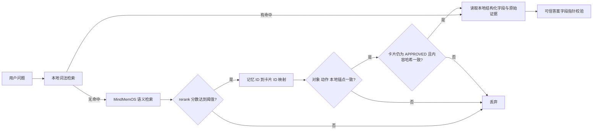

# MindMemOS 长期记忆实验接入

Ops Knowledge Studio 可以把 MindMemOS `vanilla` 模式作为可选的长期语义记忆后端。该接入是检索增强，不会替代本地 SQLite 知识库、证据链和生命周期治理。

## 信任边界



关键约束：

- 适配器与内容外发分开控制：`MINDMEMOS_ENABLED=true` 不会自动允许数据离开本机，必须再显式设置 `MINDMEMOS_ALLOW_CONTENT_EXPORT=true`。
- 外发只包含卡片 ID、标题、场景、对象、步骤、风险、回退、验证和标签等白名单字段，不包含 `source_ref`、`evidence_locator`、原始证据正文或本地路径。
- 只有人工批准后的卡片才会同步；`DRAFT`、`PENDING_REVIEW`、`REJECTED` 不同步。
- MindMemOS 返回的自由文本不直接进入答案上下文，只使用返回的 `memory_id` 查找本地持久映射。
- 本地可信检索无结果时才启用语义后备；候选必须同时达到 MindMemOS rerank 阈值，并通过本地锚点、对象类别和动作意图复核。
- 每次召回都重新读取本地卡片状态和内容哈希；卡片被驳回、替代或修改后，旧记忆即使尚未删除也会被过滤。
- 最终答案仍只能引用本地卡片中的固定结构化字段和证据定位。
- MindMemOS 不可用时自动降级到原有本地检索，不阻断审核和变更流程。
- 同步使用数据库租约和稳定幂等键；批次扫描不会被已同步的前 N 张卡片饿死，旧版本和退出批准状态的远端记忆进入退休队列并自动清理。

## 配置

先独立启动 MindMemOS，确认 `<http://127.0.0.1:8000/healthz>` 可用，并使用绑定 `vanilla` 算法且包含 `memory:read`、`memory:write` 权限的 API Key。

在本项目 `.env` 中添加：

```dotenv
MINDMEMOS_ENABLED=true
MINDMEMOS_BASE_URL=http://127.0.0.1:8000
MINDMEMOS_API_KEY=本地实验用的_vanilla_API_Key
MINDMEMOS_USER_ID=ops-knowledge-studio
MINDMEMOS_APP_ID=ops-knowledge-studio
MINDMEMOS_TIMEOUT_SECONDS=60
MINDMEMOS_TOP_K=10
MINDMEMOS_MAX_SYNC_CARDS=20
MINDMEMOS_MIN_RELEVANCE_SCORE=0.65
MINDMEMOS_MIN_LOCAL_ANCHORS=2
MINDMEMOS_MAX_SEMANTIC_CARDS=1
MINDMEMOS_ALLOW_CONTENT_EXPORT=true
```

HTTP 地址只允许指向回环主机；远程服务必须使用 HTTPS。API Key 不会出现在健康检查、统计接口、日志和前端配置中。请在确认外部 MindMemOS 实例的数据留存、访问控制和删除策略后，才开启 `MINDMEMOS_ALLOW_CONTENT_EXPORT`。

## 使用

```powershell
# 探测连接和查看本地映射统计
python run.py memory-status --probe

# 幂等同步最多 MINDMEMOS_MAX_SYNC_CARDS 张已批准卡片
python run.py memory-sync

# 观察本地词法召回和 MindMemOS 语义召回的合并诊断
python run.py search --query "第二阶段失败后应从哪一侧开始撤销"
```

Web 概览页会显示服务健康、已同步卡片数和记忆映射数，并提供手动同步按钮。直接方案查询会显示 `memory_retrieval` 诊断，包括记忆命中数、映射到的已批准卡片和最终候选。

知识卡片审批为 `APPROVED` 时会尝试即时同步。同步失败只记录为 `FAILED`，不会回滚已经完成的本地人工审批；恢复服务后可重新运行批量同步。同一卡片的并发刷新由租约合并，远端请求携带稳定幂等键。

## 当前实验结论

本地基线实验中，MindMemOS Schema 模式写入耗时约 324 秒且出现运维语义漂移；Vanilla 模式写入约 12.6 秒，并能忠实保留双 AZ 顺序、阈值和回退规则。因此当前适配器固定使用 Vanilla API Key，Schema 结果不得自动进入可信知识。

将 10 张合成 `APPROVED` 云网络卡片同步为 22 条记忆映射后，3 个刻意避开原词的跨表述问题中，原有本地严格检索 Top-1 命中 1/3，启用语义后备后命中 3/3。本结果仅用于验证接入路径和信任边界，不构成通用检索基准。

当前自动验收另含 4 个困难负例：数据库主从回退、Kubernetes Ingress 证书轮换、IAM 权限回退和无关生活问题。验收脚本要求所有正例命中且困难负例误接受率为 0；任一条件不满足即返回非零退出码。

该实验仍是单机验证：MindMemOS 自身需要 Qdrant、Neo4j、嵌入服务和模型服务。生产化前仍需补充外部服务熔断指标、独立凭据托管、企业数据分类与跨境/留存评估。
